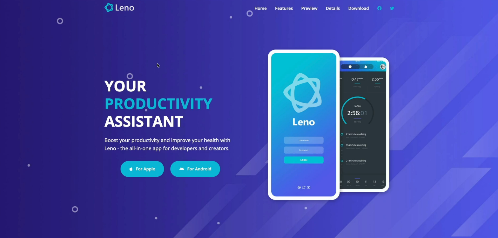

# Leno Website

Leno is an informational website for a productivity mobil app - A specific CSS methodology called BEM is used - From Brad Traversy's 'Modern HTML & CSS From The Beginning 2.0' course.

Check out the site :) - https://leno-website-fc.netlify.app/

## Development steps:

1. Project Setup

2. Navbar & Desktop Menu

3. Hamburger Button & Mobile Menu

4. Hero Section

5. Navbar Background On Scroll

6. Testimonials Section

7. Features Section & Grid

8. Features Mobile Layout

9. Preview Section

10. Animated Play Button

11. Video Modal

12. Details Area & Icons

13. Screenshots Section

14. Download Section

15. Footer

16. Create Details Page

17. Pricing Cards

18. Details Features 
